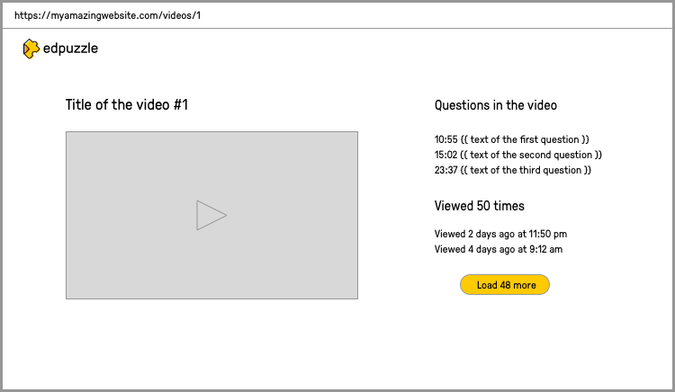

Hi Arancha! We're as excited as you are to start this code challenge and at the prospect of working together in the future. Before we get started, we want to communicate the following:

1. The code you create or ideas you have for this challenge will never be used by Edpuzzle under any circumstances.
2. The goal is to take a look at your fullstack developer skills when working on a "real life" problem. We don't expect 100% perfection but we are looking for very thoughtful iteration.
3. Remember that if the challenge goes well, there will be an opportunity to talk through about all your decisions, issues found, etc. with the other Edpuzzle team members. Writing those down as they happen is generally a good idea.
4. During the challenge you'll be assigned one or two mentors from the Edpuzzle team. This means that you can contact them via Slack to answer any question that you might have. We're looking for an excellent developer and an even better teammate.
5. If you think of anything we could improve in this challenge after you've completed it, we'd love to get your honest feedback.

# Code Challenge

## Description

Your challenge starts by jumping into the codebase of an app that can display a list of videos that contain embedded questions in them. The app is capable of playing any of these videos and pausing them once it's time to display a question. If you enjoy how this mini application is built, you'll definitely love working with us on the full suite of Edpuzzle products as their code looks very similar to the one in this application!

## Instructions

First and foremost, you are expected to understand this codebase fully, form your opinions about what you like and dislike, what you would have done differently and why, or what you have done the same and why. You will be discussing all those opinions with a couple of Edpuzzle engineering team members so we recommend that you write down whatever you need so you remember all the details.

Secondly, you will work on adding like and dislike buttons for videos on top of the existing codebase. You are required to implement this storing the information in a way that allows us in the future to list which videos a user liked or disliked.

Finally, we will be asking you the following two questions about the codebase plus other smaller ones we might come up with during our conversation:

- What would your testing strategy be to fully test this codebase?
- How would you implement a feature to retrieve the duration of videos from YouTube API in order to display it in the UI (you don't need to implement this in code, just have to talk about it with us).

## Communication channels

An invitation to a private Slack channel will be sent to your email. You can use that channel to discuss anything related to the code challenge with your assigned mentor/s.

For questions or updates on your interview process, please use the same communication channel you were using before the code challenge.

## Running the code

This repo uses Turborepo (https://turbo.build/) to manage apps, packages, etc. To run the application, you just need to run `npm run dev` in the root of the project and both the backend and frontend will be executed. Follow the console output instructions to find the url to open in your browser.
